# This Repository will contain all my machine learning work!!!

# Day 1

Today, I continued learning Machine learning Algorithms. I learned about Naive Baye's algorith which is used to solve classification problems having many 
independent features.

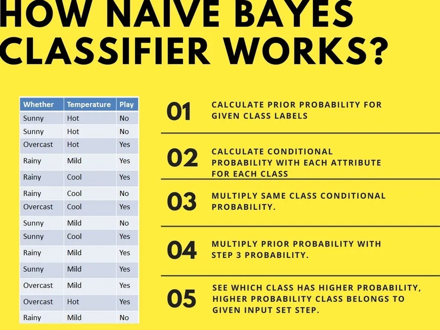

# Day 2
Revised the concept of Simple Linear Regression through practical implementation with the help of Krish Naik's video. It was littele bit hard for me to grasp the concept of everything as I am a beginner but hope to keep learning and improving.

# Day 3

The k-Nearest Neighbors (KNN) algorithm is a versatile and simple supervised machine learning algorithm used for both classification and regression tasks. It's a non-parametric and instance-based learning method, meaning it doesn't make explicit assumptions about the underlying data distribution and stores the entire training dataset in memory for prediction. Here's how KNN works:

### Basic Idea:

- Training Phase:
 In the training phase, KNN simply memorizes the entire training dataset. No actual "learning" occurs during this phase, which is why it's considered non-parametric.

- Prediction Phase:
 When a prediction is required for a new, unseen data point, KNN looks at the K-nearest neighbors of that data point within the training dataset. These nearest neighbors are identified based on a distance metric, typically Euclidean distance, but other metrics can be used.

- Voting (Classification) or Averaging (Regression):
 For classification tasks, KNN counts the class labels of the K-nearest neighbors and assigns the majority class as the prediction. For regression tasks, it averages the target values of the K-nearest neighbors to make the prediction.

 ### Key Parameters:

- K (Number of Neighbors): 
The most crucial hyperparameter in KNN is K, which determines how many neighbors are considered when making a prediction. A smaller K value may lead to a noisy prediction, while a larger K value may result in a smoother but potentially biased prediction.

- Distance Metric:
 The choice of distance metric affects how KNN calculates the similarity between data points. Common distance metrics include Euclidean distance, Manhattan distance, and Minkowski distance.

### Advantages of KNN:

- Simple and easy to understand.
- No model training involved during the training phase.
- Versatile: Suitable for both classification and regression tasks.
- Effective when the decision boundary is nonlinear or complex.

### Disadvantages of KNN:

- Memory Intensive: 
   KNN stores the entire training dataset, making it memory-intensive for large datasets.
- Computationally Expensive: 
   Calculating distances between data points can be computationally expensive, especially for high-dimensional data.
- Sensitive to the Choice of K: 
   The choice of K can significantly impact the model's performance. It requires careful tuning.
- Not Suitable for High-Dimensional Data: KNN's performance tends to degrade as the dimensionality of the data increases (curse of dimensionality).

### Use Cases:

- KNN is often used in recommendation systems, such as recommending products or movies based on user behavior.
- It's suitable for image classification tasks.
- In anomaly detection, KNN can identify outliers by considering data points with few nearby neighbors as anomalies.- 
- KNN can be used in text classification and natural language processing (NLP) tasks.
- Choosing the Right K: Selecting the appropriate K value is essential for the performance of the KNN algorithm. It involves experimentation and might require  cross-validation to determine the K that results in the best performance for your specific dataset. A small K value (e.g., 3 or 5) may capture noise, while a large K value may lead to oversmoothed predictions.

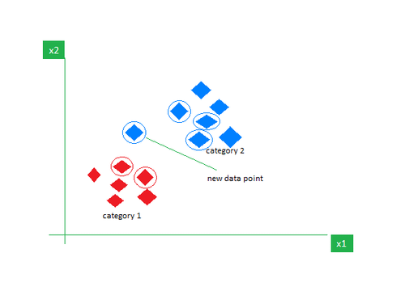

# Day 4

  Learning about Underfitting , Overfitting and generalized model is very important in Machine Learning. 

### Overfitting 
   When the best fit line completely fitted through all training data, then the modwl is said to be overfitted. In this case, model is
   - Low Biased
   - High variance

### Underfitting
   When the best fit line is distant from the training datasets then the model is said to be Underfitted. In this case, model is
   - High Biased
   - Can be low variance or high variance

### Generalized model
   When the best fit line is accurately/precisely fitted with training datasets then the model is considered to be Generalized. In this case, model is
   - Low Biased
   - Low variance.

   **Note:** Biasness is generally used for model with training dataset and Variance is used for model with testing dataset. 

# Day 5

  Today, I learnt the concept of Confusion matrix and accuracy performance parameter in Machine Learning Algorithm. It is one of the most used performance metrics in classification. 

### Confusion Matrix:
   It a table that shows the number of True Positive i.e. (1,1), True Negative i.e. (0,0), False Positive i.e. (1,0) and False Negative i.e. (0,1).Our aim is to reduce False Positive and False Negative values and increase True Positive and True Negative Values. 

### Accuracy:
   It measures the overall correctness of the model. The main disadvantage of accuracy as performance parameter iit doesn't work well with imbalance datasets.

   - Formula to calculate accuracy is:
      (TP + TN)/(TP + TN + FP + FN)

**Note**: In coordinate (x,y) used above, the value of x represents predicted values whereas the value of y represents actual values of the datasets.

# Day 6
  After learning about confusion matrix yesterday, Today I learnt the concept of precision, recall and F1 score performance parameter in binary classification.

### Precision
   It is known as positive predictive value, measures the proportion of true positive prediction out of all positive predictions. It helps to understand the accuracy of positive predictions.

 - **For Example:** Let's take an example of logistic regression model which classifies the email as 'Spam' or 'Not Spam'. Now, if our model predicts a mail as 'Spam' but in real if it not actually 'Spam' then its a blunder, right? So, in this case, we use precision performance parameter to reduce False Positive.
   
**Formula of Precision:** (True Positive)/(True Positive + False Positive)

### Recall
   It measures the proportion of true positive predictions out of all actual positives. It helps to understand how well the model identifies positive instances.

- **For Example:** If a person is suffering from cancer but our model predicts that s/he is not suffering from cancer then thats again a huge blunder. In this case, recall parameter is used to reduce False Negative.

**Formula of Recall:** (True Positive)/(True Positive + False Negative)

### F1 Score
   The F1-score is the harmonic mean of precision and recall. It provides a balance between precision and recall, especially when dealing with imbalanced datasets.

   - **Example:** The prediction of stock market whether it will crash tomorrow or not, we have to use F1 score i.e. both precision and recall as we have to reduce both false positive and false negative. 

   - **Note:** It is one of the kind of F-beta score where both reducing both false positive and fasle negative is important.

# Day 7
Today, I grasped the basic concept of Support Vector Machines(SVM) which is used to solve the problems of both supervised learning i.e. Regression and Classification. In SVM, we need to find the best fitting hyperplane and along with that hyperplane we need to find parallel vectors which is referred as Marginal plane.
    Today, I learned about SVC only. I got know that while classifying the dataset, we have to make sure to make best fitting hyperplane and their supporting vectors. The most importtant thing here is that the distance between the marginal planes should be more so as to reduce the probability of misclassification.

# Day 8
 
 Today, I learnt the concept of Decision Tree in machine learning. It structures decision based on input data, making it suitable for both classification and regression tasks that's why it is called **CART** i.e. Classification and REgression Tree. Its Geometric Intuition is that it converts hyperplane parallel to any of the axes into hyper cuboid in 3D space. 

 ### Entropy
 Entropy is the measure of Disorder or the measure of purity/impurity or measure of uncertainity of random variables.

 - More Knowledge, less Entropy and vice versa
 - Formula:
    H(X) = – Σ (pi * log2 pi)

### Entropy vs Probability
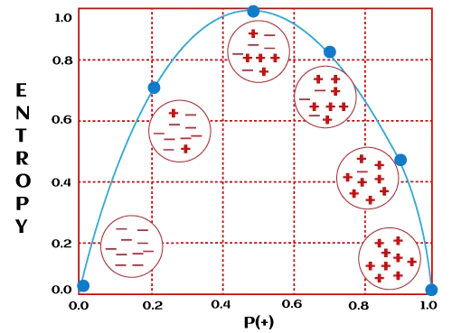
 
 In the system, all the probability is either 0 or 1 then entropy is 0 but if the probability is somewhere in the middle then entropy changes and is no longer 0.

 ### Information Gain

 It is a metric used to train decision trees. Specifically, this metric measures the quality of split.

 - Formula:
   Information Gain = E(Parent)- {Weighted Average}*E(Children)

 ### Gini Impurity
  
  Gini Impurity is a measurement used to build Decision Trees to determine how the features of a dataset should split nodes to form the tree. It is more similary to that of entropy. More precisely, the Gini Impurity of a dataset is a number between 0-0.5, which indicates the likelihood of new, random data being misclassified if it were given a random class label according to the class distribution in the dataset.

# Day 9
Today, I did practical implementation for Decision tree using Post Prunning technique. It is the technique in which tree model is built first and then parameters are used later to ensure balanced tree and good accuracy. The test is performed on iris dataset.

- Below is code snippet:
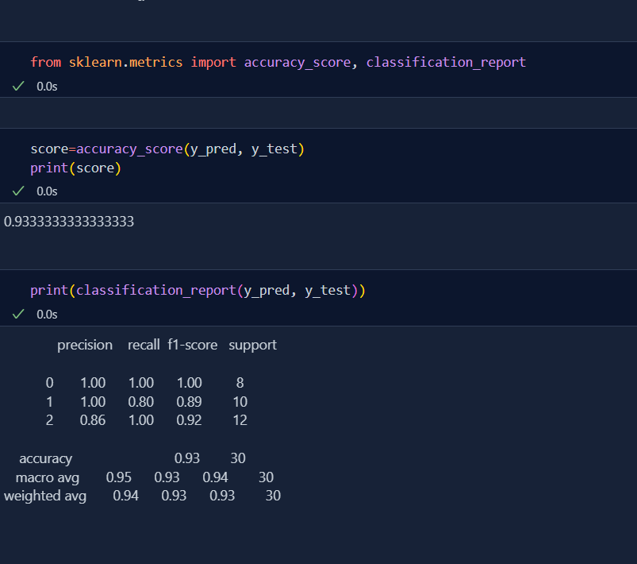
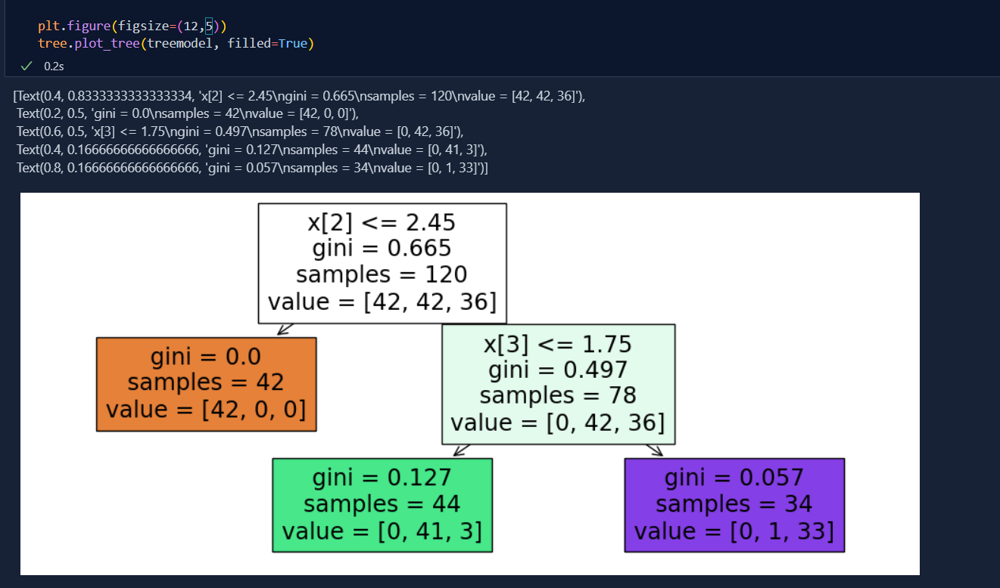

# Day 10
I did decision tree classification using pre-prunning technique where I gave all possible parameters and used GridSearchCV to find the best params and apply it to get accuracy of 93.33 which is very good and I hope there is less overfiting of the data by the model.

- Below is the code snippet:
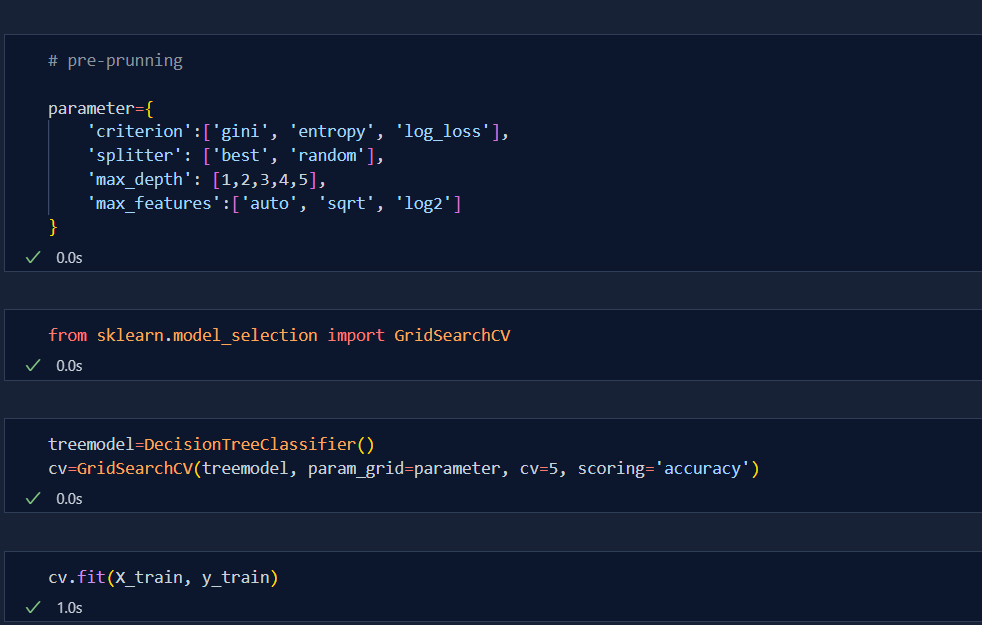

# Day 11
Today, I did Decision Tree  Regression along with its indepth intuition. Since Decision tree is also called CART algorithm, we can use this for regression problem. For classification, we used various hyperparameters like Entropy, Gini Impurity, Information Gain, etc. Similary to that for regressor, we calculate MSE or MAE which is variance in general.

- formula for mse:
   
   MSE = (1/n) * Σ(actual – forecast)2

And we do variance reduction and find out the decision node. If the variance reduction is higher than we chose them.

- formula for variance reduction is:
   
   Var(Root)- Σwi * Var(child)

# Day 12

Today's topic is **Ensemble Learning** which some way blew out my mind. I got to know about the concept called **Wisdom of the Crowd**. Ensemble learning is based on the same concept. Ensemble learning is a machine learning technique that enhances accuracy and resilience in forecasting by merging predictions from multiple models. It aims to mitigate errors or biases that may exist in individual models by leveraging the collective intelligence of the ensemble. The underlying concept behind ensemble learning is to combine the outputs of diverse models to create a more precise prediction. It works on both:
 
 - Classification: uses majority prediction
 - Regression: uses mean value of all prediction.

#### Implementation
Ensemble learning should have different base models for prediction. It can be achieve in 2 main ways:

- Using different ML models,
- Using same ML models but training them on different datasets

#### Types of Ensemble Learning
- Voting Ensemble
- Bagging also called (**Boostrapped Aggregration**)
- Boosting
- Stacking

### Why Ensemble Learning works?

- For classification

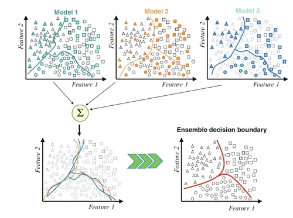

- For Regression

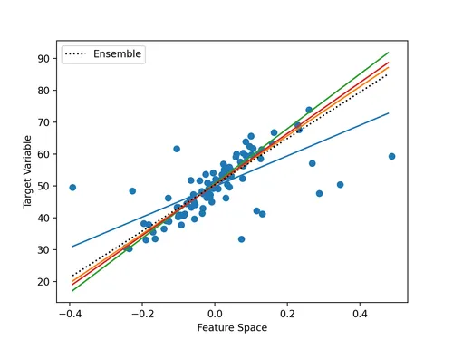

# Day 13
Today, I did **Voting Ensemble Classification**. In this, I implemented both the techniques of Ensemble that using different algorithms and using same algo with different dataset. I also got to know the concept of **Soft** voting and **Hard** voting in Voting Ensemble.

- **Hard Voting:**In hard voting (also known as majority voting), every individual classifier votes for a class, and the majority wins. In statistical terms, the predicted target label of the ensemble is the mode of the distribution of individually predicted labels.

- **Soft Voting:** every individual classifier provides a probability value that a specific data point belongs to a particular target class. The predictions are weighted by the classifier's importance and summed up. Then the target label with the greatest sum of weighted probabilities wins the vote.

- Below is code snippet:

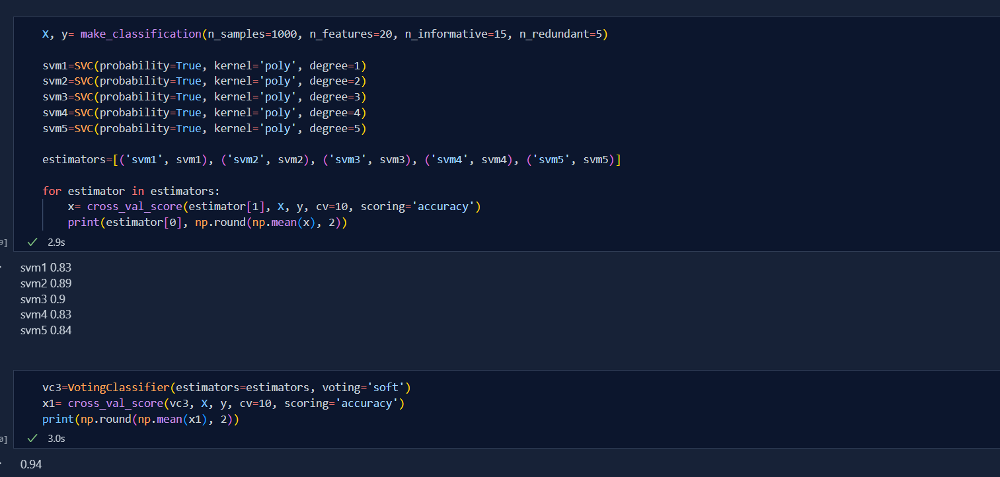

# Day 14
Did Ensemble Learning on Voting Ensemble Regressor on dataset from sklearn i.e. Diabetes dataset and did it using both the techniques. I used Linear Regressor, Simple Vector Regresor and Decision Tree Regressor.

- Below is code snippet:
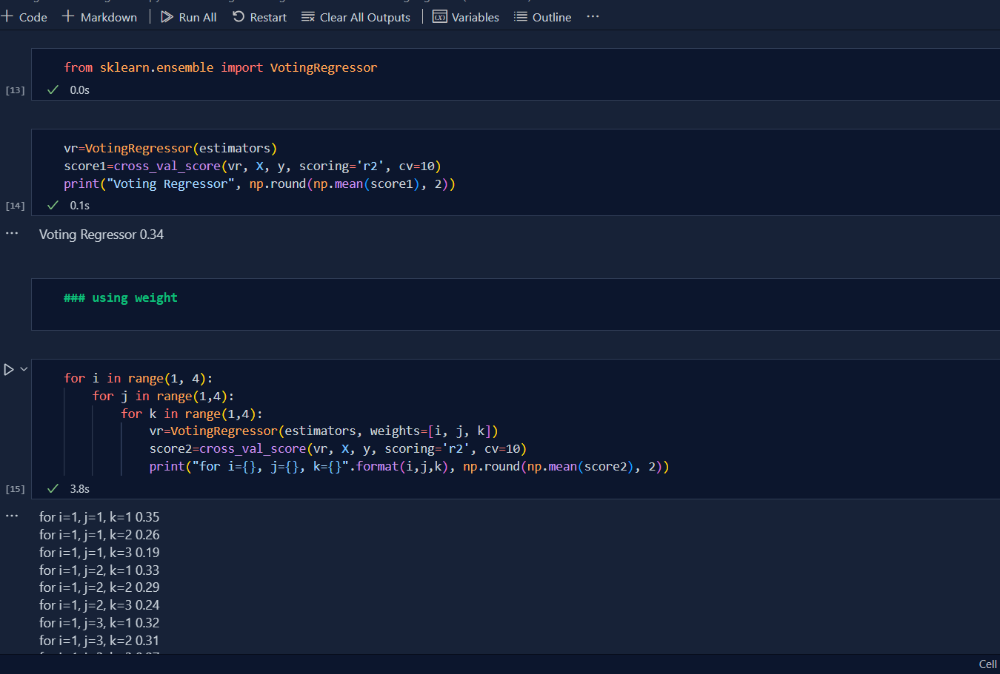

# Day 15
Today Out of Curiosity, I decided to learn the implementation of Linear Regression from Scratch. I did implement with the help of python code and I will be trying to do others as well in coming future.

- Below is the code Snippet:

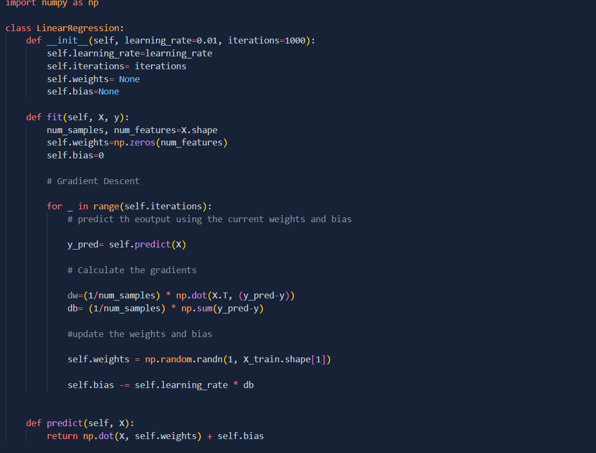

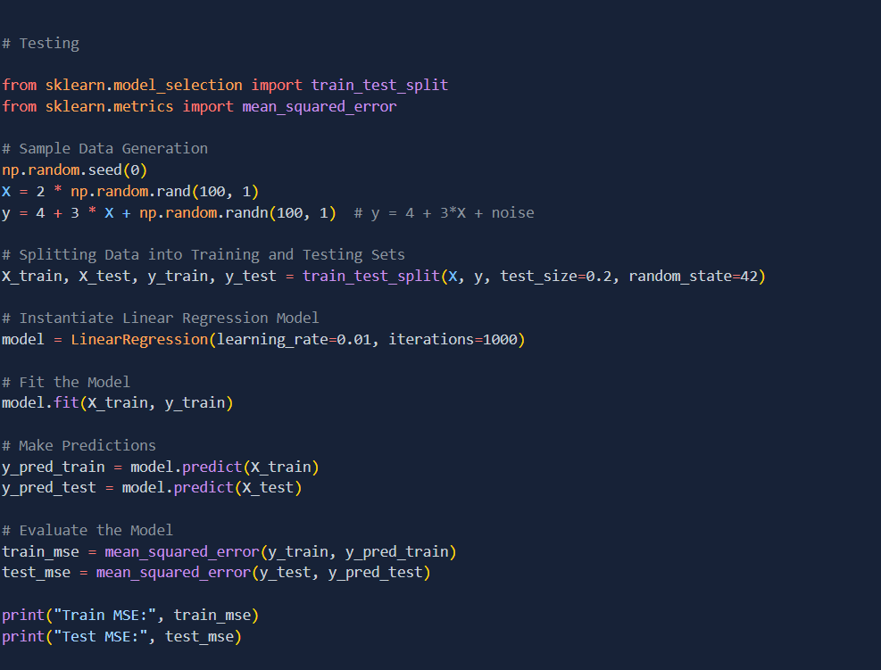

# Day 16
  During My learning in machine learning, I started bagging ensemble learning. It is similarly to that of voting ensemble. **Bagging** stands for **BootStrapping and Aggregration**. The key difference here is that bagging is used with decision trees, where it significantly raises the stability of models in improving accuracy and reducing variance, which eliminates the challenge of overfitting.The dataset into various subsets and those subset are feed to that models.  
        I also studied the concept of **Random Forest** which is one of the powerful bagging concept.Random forests or random decision forests is an ensemble learning method for classification, regression and other tasks that operates by constructing a multitude of decision trees at training time. For classification tasks, the output of the random forest is the class selected by most trees. For regression tasks, the mean or average prediction of the individual trees is returned.Random decision forests correct for decision trees' habit of overfitting to their training set. More on Random Forest soon!

# Day 17
 Random forest is very powerful ensemble learning techniques. **Random forest** works well very much because It helps to make **Bias-Variance tradeoff** balance. While designing our model, our main aim should be target to make **Low Biased and Low Variance** model which is impossible to get in almost all models. 

 #### Why Random Forest Works so well?
 It is because our decision tree's in random forest should be fully grown i.e. **Max_depth=none** due to which our model will be overfitted resulting in Low Bias and High Variance. But the main game changing idea here is when the data are trained to base models, they are drawn randomly and fed to model. Because of this, the impact of noisy points(Outliers) is distributed randomly to base models due to which Low variance is achieved. This is the main reason why RF is powerful.

 #### Random Forest Vs Bagging
- Random Forest have all the base models as Decision Tree whereas Bagging might have same as well as different base models.
- In Random Forest, the feature(Column) sampling is done at node level. This means each time sampling is done at nodes due to which different features are present in different nodes. But in bagging, the feature sampling is done at tree level. This means first feature is selected and then tree is built.

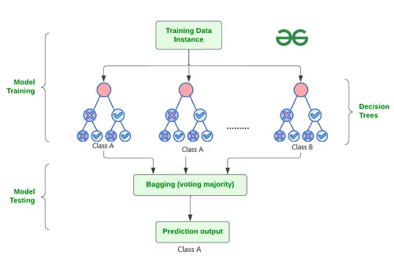

# Day 18
OOB stands for **Out Of Box** Evaluation. This is concepts explains that while doing sampling in ensembling learning, there will be some sort of data that we not be fed to the model. This means the data is hidden from model, which according to the experiment performed is around 37%. So this set of data can be used for validation testing in machine learning.Mainly used in the bagging algorithms to measure the error or the performance of the models in every epoch for reducing the total error of the models in the end.

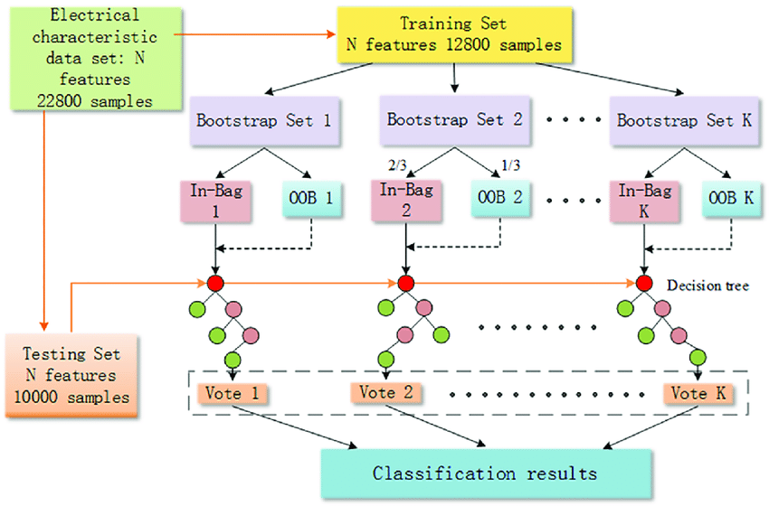

# Day 19
Feature importance in ML is very importance especially in tree based algorithm like decision tree, randomforest, etc. It helps us to identify the important feature in datasets and avoid not contributing feature which saves lots of computational power.

- Below is code snippet:
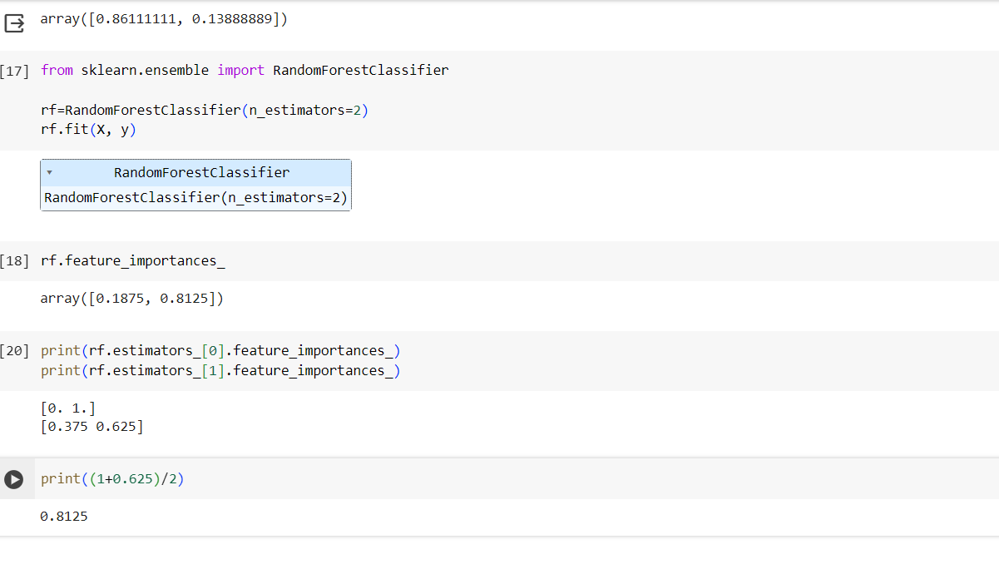

# Day 20
KMeans is a popular clustering algorithm used in machine learning and data mining. It is an unsupervised learning technique aimed at partitioning a dataset into a predetermined number of clusters. The algorithm works by iteratively assigning each data point to the nearest cluster centroid and then recalculating the centroid of each cluster based on the data points assigned to it. This process continues until convergence, typically defined by minimal changes in cluster assignments or centroid positions.

### Steps of KMeans
- **Initialization**: Randomly choose the initial cluster centroids.

- **Assignment**: Assign each data point to the nearest cluster centroid based on a distance metric, commonly Euclidean distance.

- **Update Centroids**: Recalculate the centroid of each cluster by taking the mean of all data points assigned to that cluster.

- **Repeat**: Iterate steps 2 and 3 until convergence, which occurs when the cluster assignments and centroids no longer change significantly.

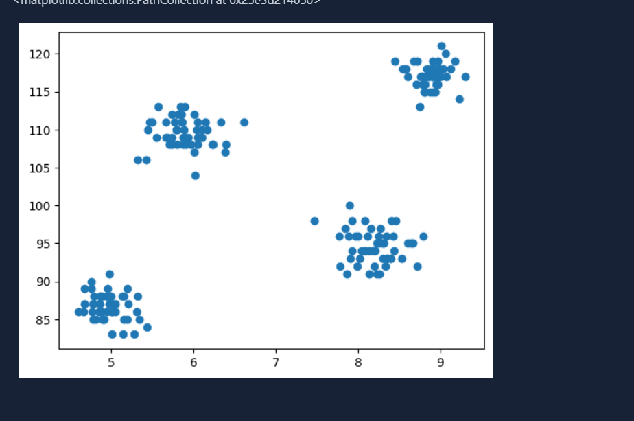
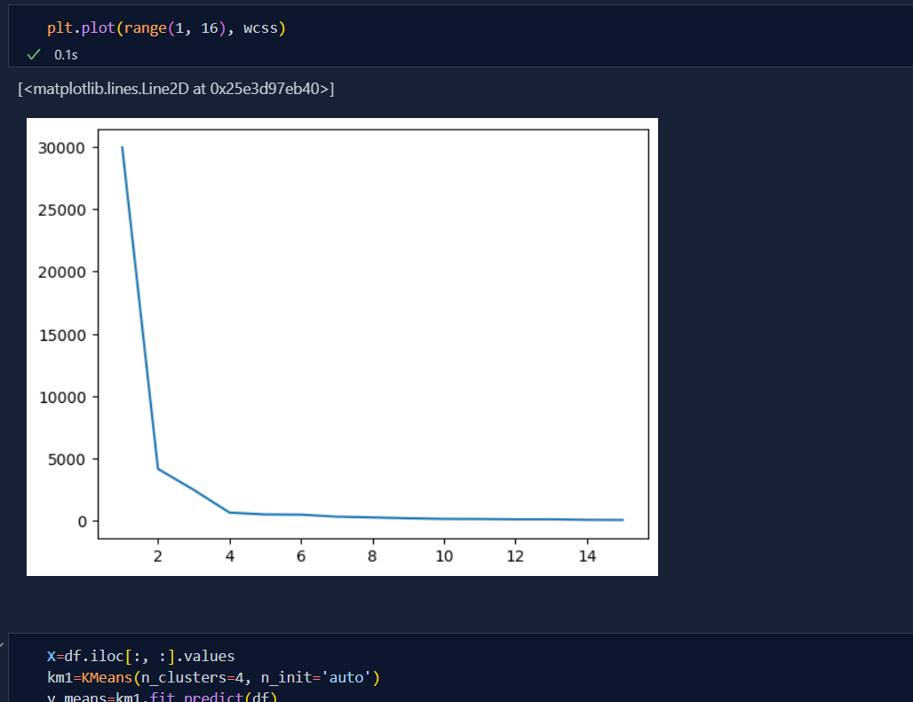

# Day 21
Today, I did practical implementation of KMeans Clustering from scratch which helped me to strengthen my concept.

- Below is code snippet:
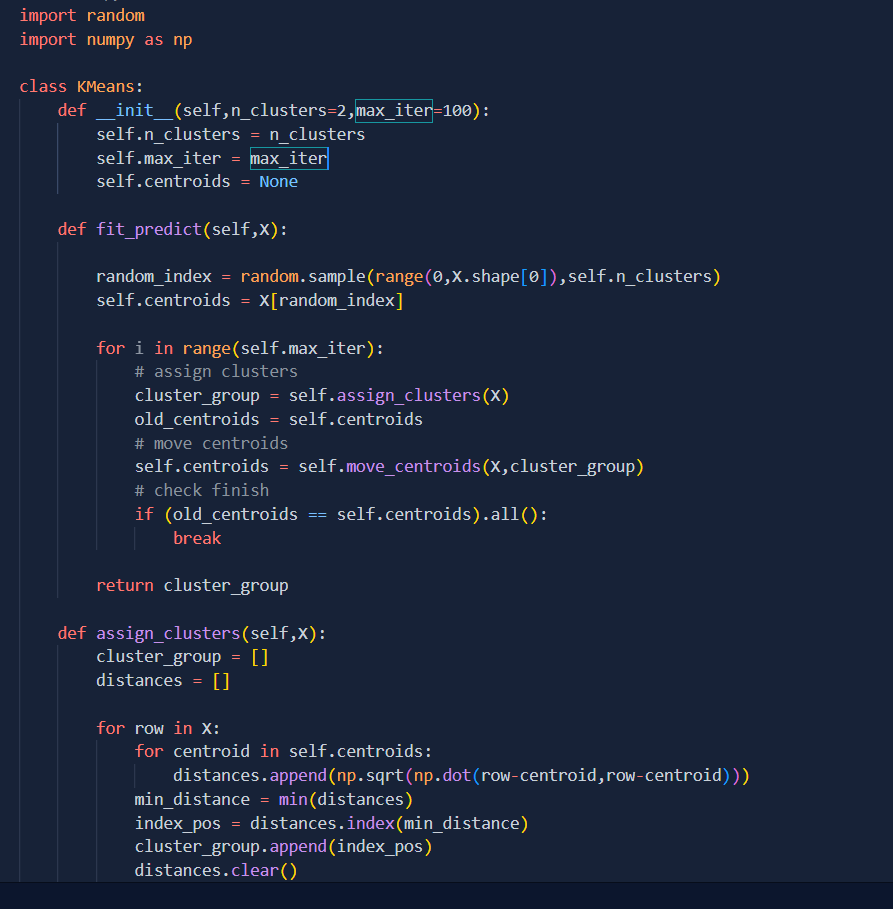
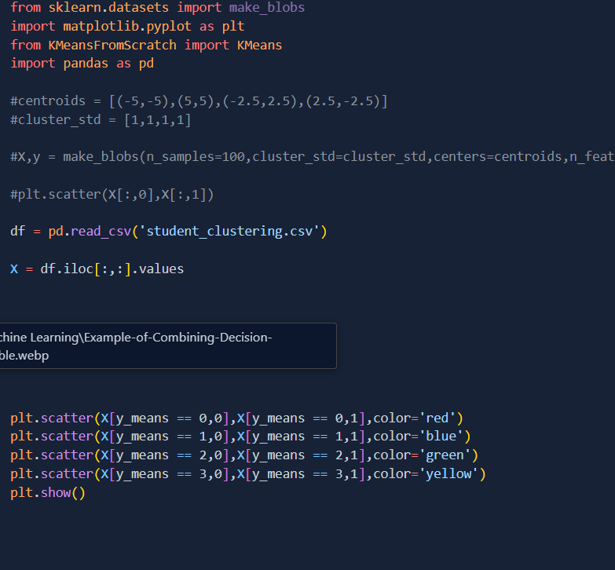

# Day 22
Gradient boosting algorithm is one of the most powerful algorithms in the field of machine learning. As we know that the errors in machine learning algorithms are broadly classified into two categories i.e. Bias Error and Variance Error. As gradient boosting is one of the boosting algorithms it is used to minimize bias error of the model.

#### Appplication
- Gradient Boosting Algorithm is generally used when we want to decrease the Bias error.
- It can be used in regression as well as classification problems. In regression problems, the cost function is MSE whereas, in classification problems, the cost function is Log-Loss.

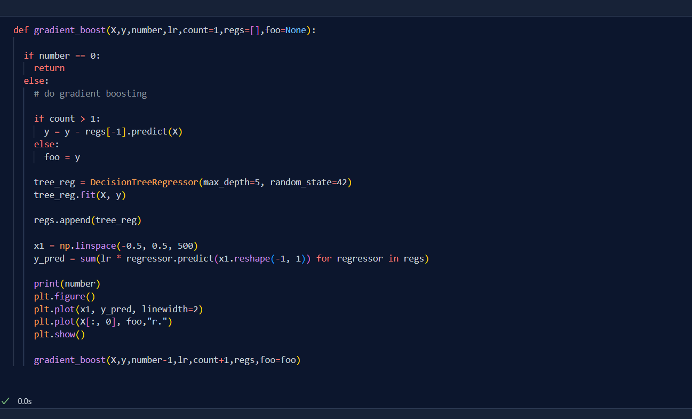
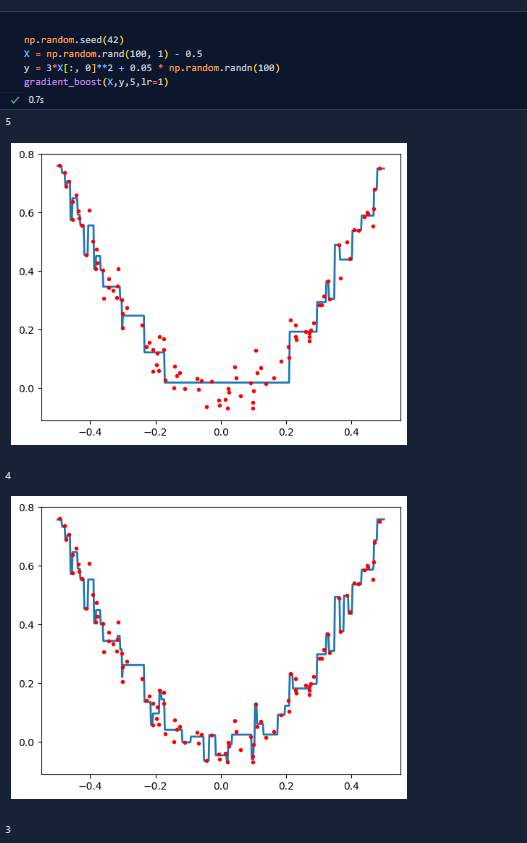

# Day 23
Today, I studied about Gradient Boosting Classifier. A loss function is a critical component that lets us quantify the difference between a model’s predictions and the actual values. In essence, it measures how a model is performing. 

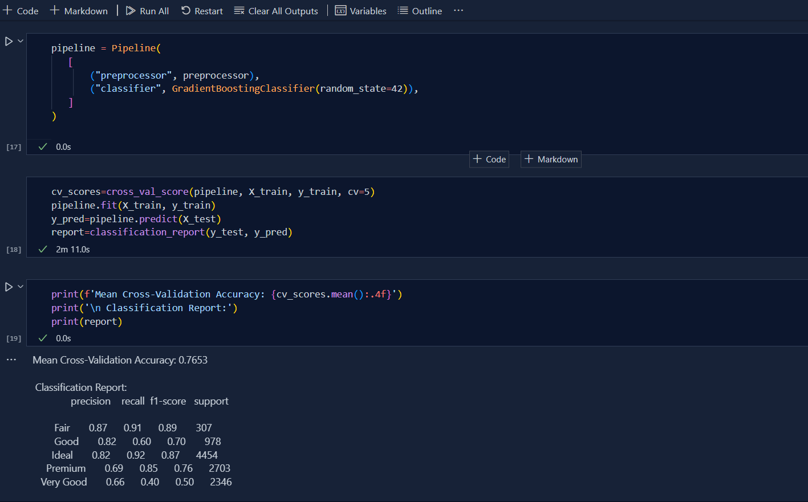

# Day 24
Today, I revisited the concept of SVM and did its practical implementation. SVM generates optimal hyperplane in an iterative manner, which is used to minimize an error. The core idea of SVM is **to find a maximum marginal hyperplane(MMH) that best divides the dataset into classes.**

- **SVM Kernels:**
The kernel takes a low-dimensional input space and transforms it into a higher dimensional space. In other words, you can say that it converts nonseparable problem to separable problems by adding more dimension to it. It is most useful in non-linear separation problem. Kernel trick helps you to build a more accurate classifier.

- Below is the code:
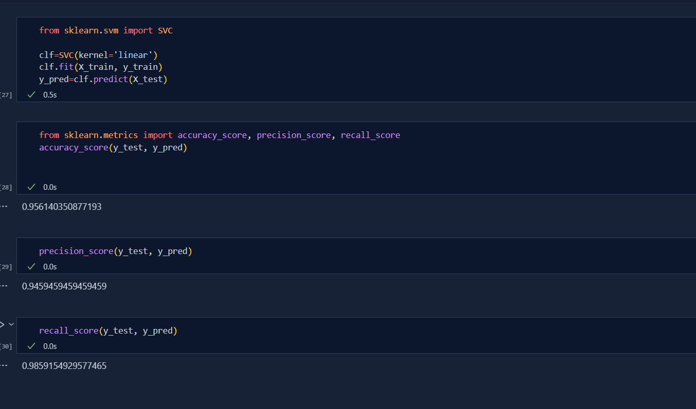

# Day 25
Today, I did the Xgboost regression mathematical intuition and did basic coding on regressor.

- Below is the code snipppet:

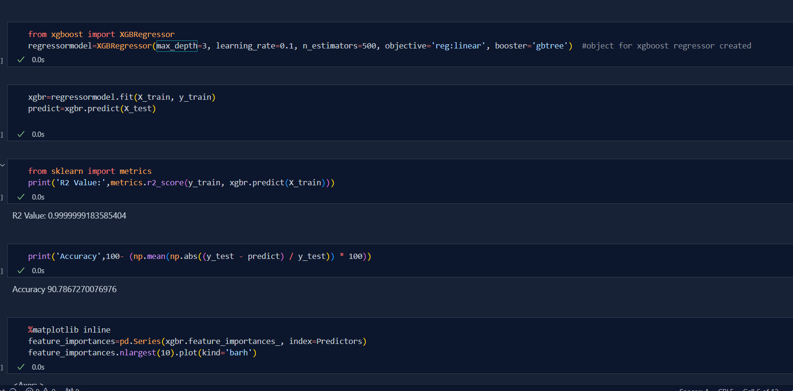

# Day 26
**Re-Learning Concept: Logistics Regression**
I did the practical implementaion of logistics regression. Logistic regression is the appropriate regression analysis to conduct when the dependent variable is dichtomous(binary).

#### Since, it is a predictive model why not use linear regression instead?

- First and foremost, the dependent variables(targets) are continous in linear regression whereas din logistic regression, they are binary values.

- Linear Regression is prone to outliers i.e if there are sensitive outliers our linear model may predict values out of range. This means that the prediction can be more than 1 or less than 0 which in our case wont be accpetable.

#### Sigmoid function

A sigmoid function is any mathematical function whose graph has a characteristic S-shaped curve or sigmoid curve.
 Logistics regression uses sigmoid function which classifies the datasets and predicts the values within the range of 0 and 1.

 - Logistic Regression formula:
     
     p=1/(1 + e^(-z)) 
         where z = mx+c

- Below is the code snippet:

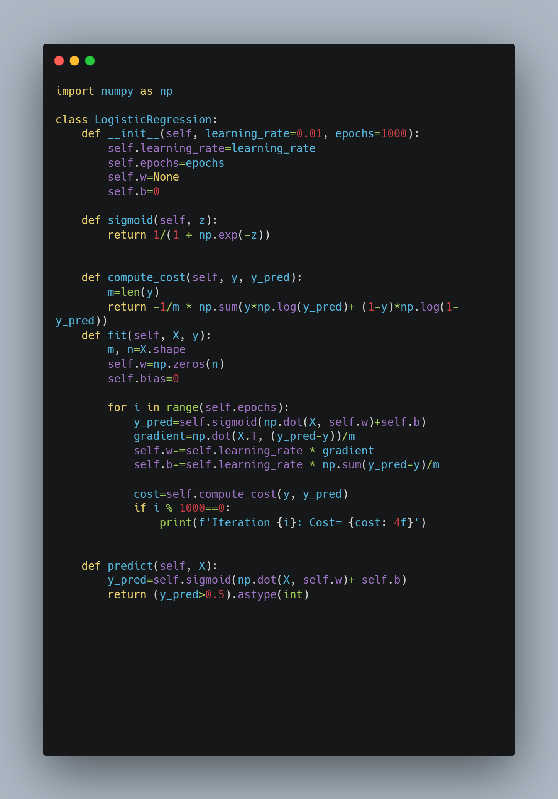
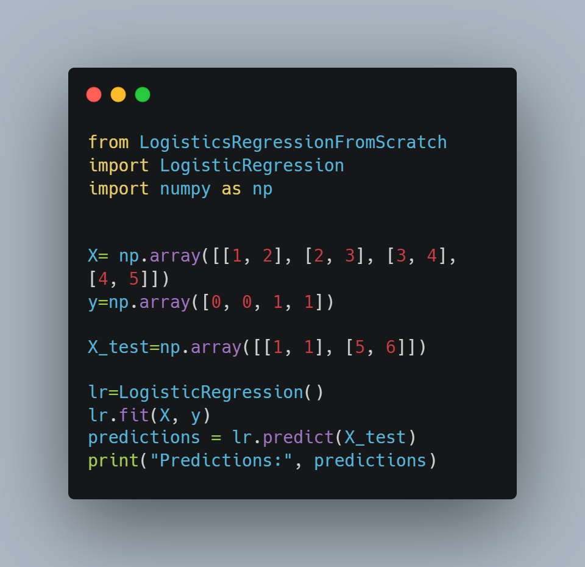

# Day 27
 **Re-Learning of Naive Bayes**
 - Naive Bayes is a probabilistic classification algorithm(binary o multi-class) that is based on Bayes’ theorem.
 - Naive Bayes can be used for a variety of applications, such as spam filtering, sentiment analysis, and recommendation systems.

 #### Assumptions made by Naive Bayes?
- Features are conditionally independent of each other.
- Each of the features is equal in terms of weightage and importance.
- The algorithm assumes that the features follow a normal distribution that's why standardization of dataset is easy.
- The algorithm also assumes that there is no or almost no correlation among features.

- Below is code snippet:
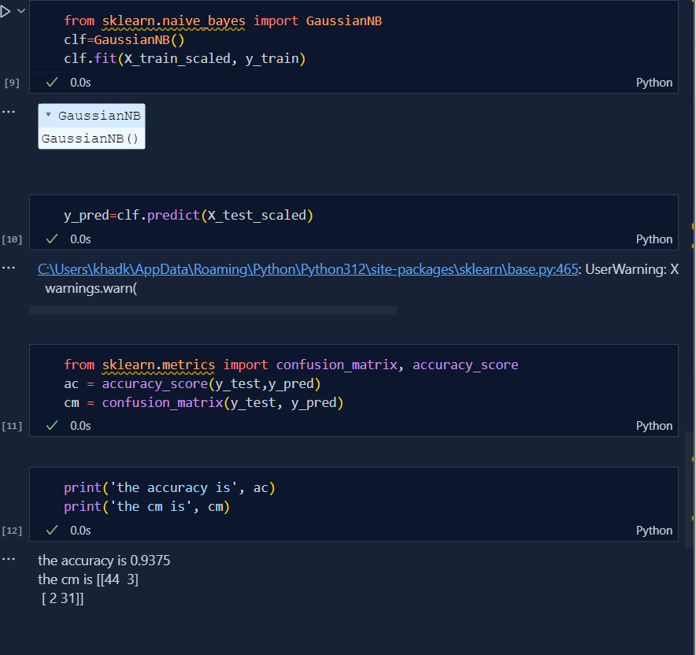

# Day 28
**Re-Learning Bagging Ensemble:**
Bagging (bootstrap aggregating) is an ensemble method that involves training multiple models independently on random subsets of the data, and aggregating their predictions through voting or averaging.In detail, each model is trained on a random subset of the data sampled with replacement, meaning that the individual data points can be chosen more than once. This random subset is known as a bootstrap sample. By training models on different bootstraps, bagging reduces the variance of the individual models. It also avoids overfitting by exposing the constituent models to different parts of the dataset.
Bagging is particularly effective in reducing variance and overfitting, making the model more robust and accurate, especially in cases where the individual models are prone to high variability.

- Without Bagging
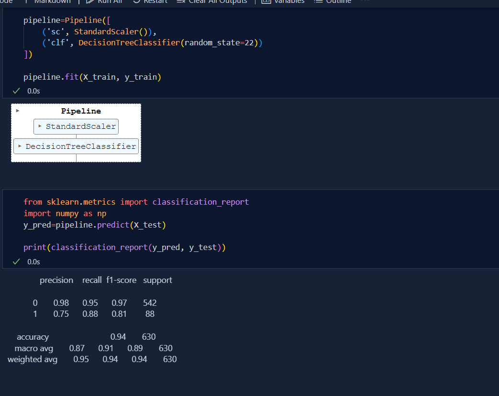

- With Bagging
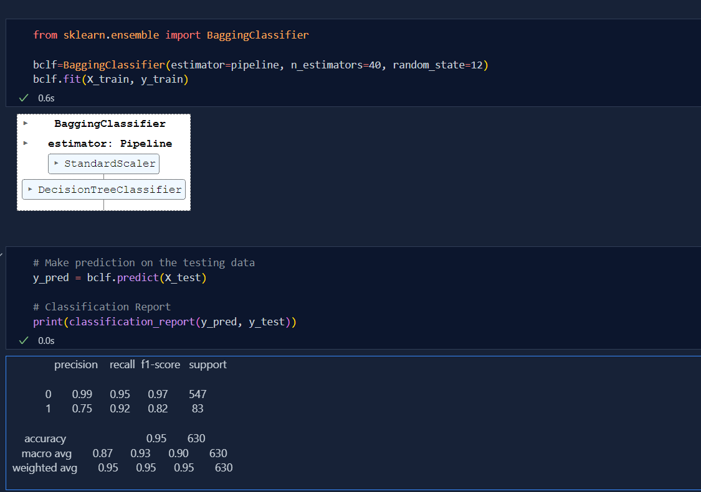

# Day 29
Today, I have Started End-to-End Ml project on **California Housing Prediction.** I created a file directory for the data extration and saving it into local directory and converting it into dataframe using pandas library. Similary, I crated python function for splitting datas and created train and test set of the dataset for the further project. Did visualization of the dataset to gain the insight of the data which will help to understand the dataset better.

- Project Snippet:
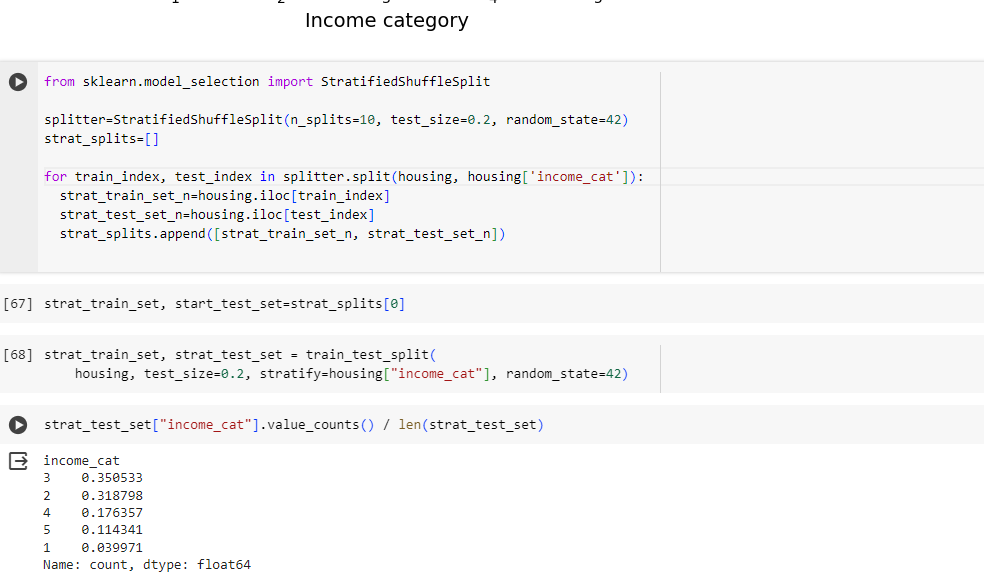
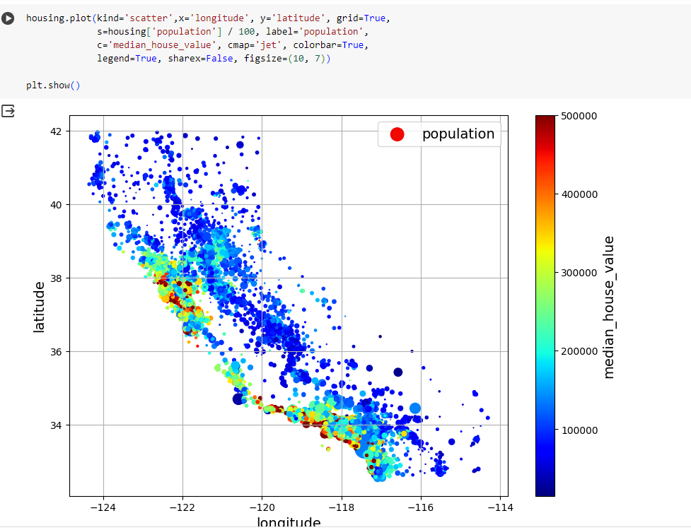

# Day 30
I did Data cleaning and data preprocessing for the better performance of the model. First, i replaced Null value with  median of the same attribute. Then handling categorical data was very important as ML models works only on numerical data.

- **Ps: This diagram is not of Data cleaning but of dataset visualization.**

# Day 31
Today, I continued with the project and did two major things i,e **design and Used built-In transformers** and **Feature Scaling**

- Transformers:
 It is used to transform the values of the attributes. In our project, there are numerical as well as categorical values. Similarly, in numerical value, there is missing values and all. During feature engineering, we need to handle all of these effectively due to which we need transformer. I built one custom transformer to add extra attributes and used scikit-learn built-in Column Transformer.

 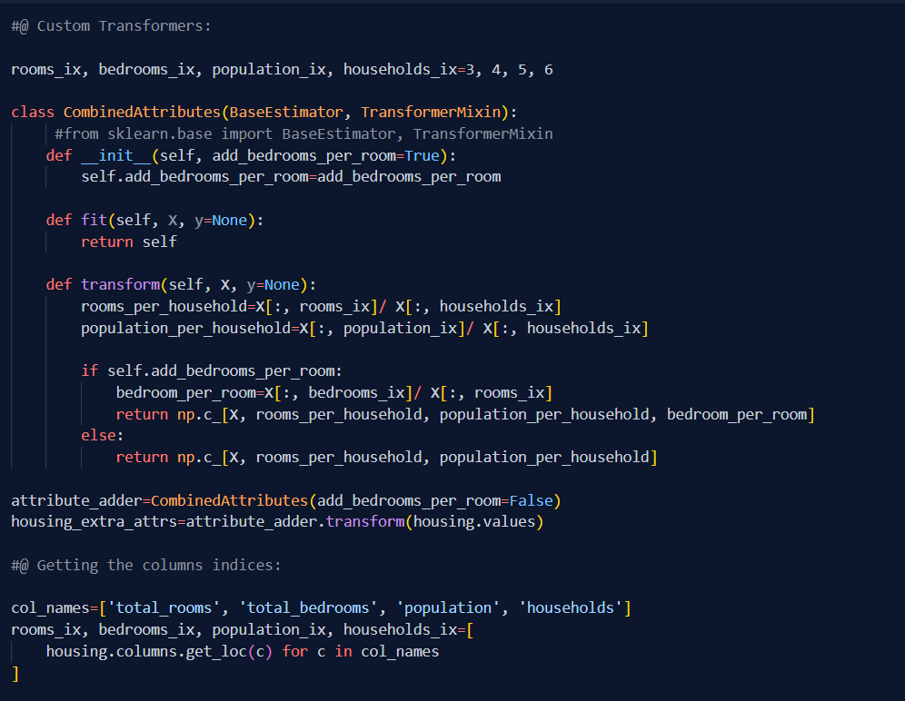

 - Feature Scaling:
 As we know in numerical values of our dataset, there are various kinds of data which creates imbalance for ML algorithms to predict resulting in bad accuracy. So we did Standardization and Normalization of our dataset before training it into ml model. 

 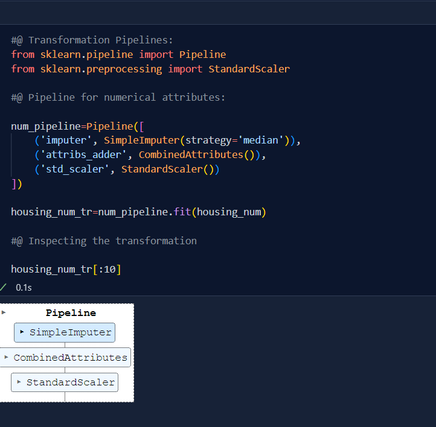

# Day 32
After completion of Feature Engineering, I finally trained Machine learning model for predictions. Today, I created Linear Regression object, train data and predict the values but didn't get quite well scores. So, I also trained my datasets with decision tree algorithm which happens to be better than linear regression.

- Linear Regression Model:

- Decision Tree Model:

# Day 33
Today, I did Model Tuning and did Cross_Validation on both linear Regression and Decision Tree. The overall result in cross validation of both the models built previously wasn't performing so good so far. Therefore, I used Ensemble learning technique called Random Forest i.e Bagging which happenend to perform better than those prev models.

- Cross Validation Scores:

- Model Tuning:

# Day 34
Finally, Today, I completed my project on **California Housing Price Prediction** and got a chance to learn many more things during project. I will be doing more projects in order to test my knowledge.

- Below is code snippet:

# Day 35
Today, I did revision on the intuition of KMeansClustering and built model from scratch.
- Below is code snippet:
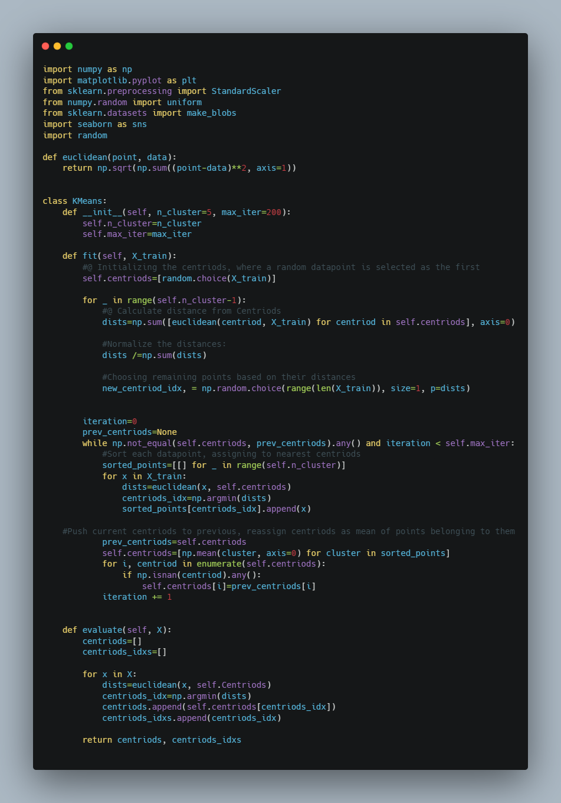

# Day 36
Continued writing/learning KMeans Code from scratch. Today, I did testing of the code written from scratch and tried debugging them. Similary, I also read about teachniques esp. **Elbow Method** which is used to determine the number of clusters in the program which is one of the most important and daunting task.

- Below is the elbow method graph plotted with the help of self created data:
.png)

# Day 37
Unlocked the concept of one of the finest method of clustering in Unsupervised LEarning. **DBSCAN** stands for **Density Based Spatial Clustering of Applications with Noise.** This Method is widely used for clustering and works only on training dataset sadly not predicting but it makes proper clustering. The main problem with other clustering algorithm is that they are unable to cluster in arbitrary shapes. 

- Parameters in DBSCAN:
1) **Epsilon:** It is the radius of the circle to be created around each data point to check the density.
2) **minPoints:** It is the minimum number of data points required inside that circle for that data point.

- Types of points in DBSCAN:
1) **Core points:** If the point has more or equal points than monPoints inside epsilon then that points is considered as Core points.
2) **Border points:** If the point has less than minPoints but greater than 1 points then that points is considered as Border points.
3) **Noise ponts:** If the point has no points inside epsilon radius then it is considerd as noise points.

# Day 38
Today I did practical implementation for DBSCAM using sklearn and saw how it clusters data based on density in concentric circle.

- Below is code snippet:
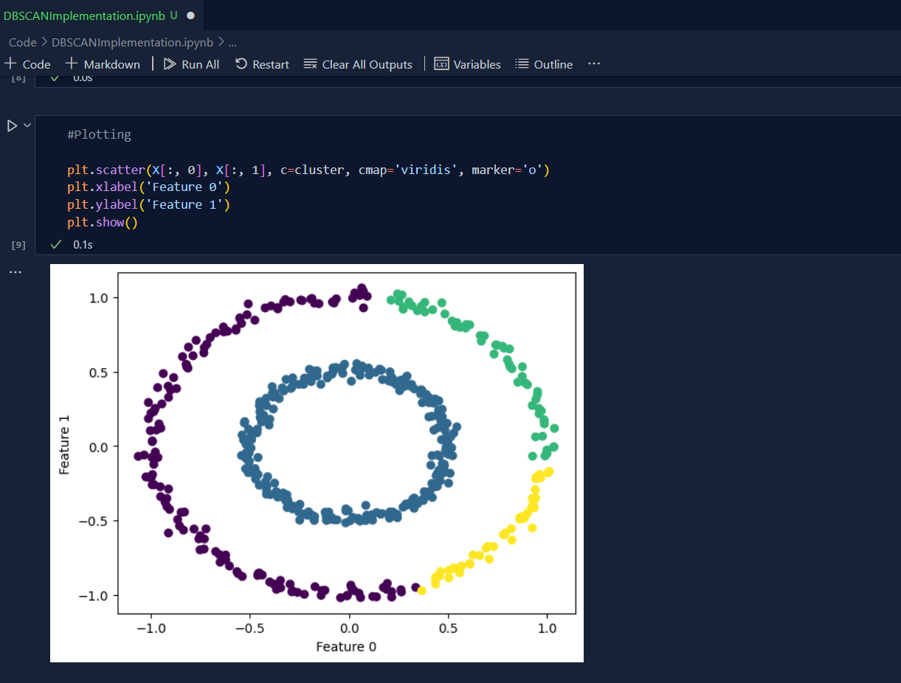